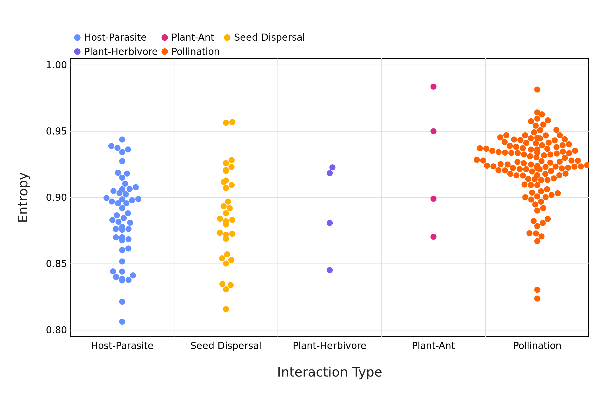
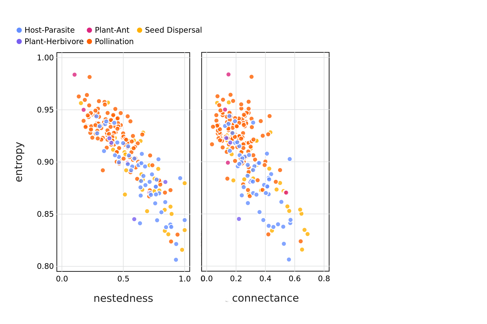
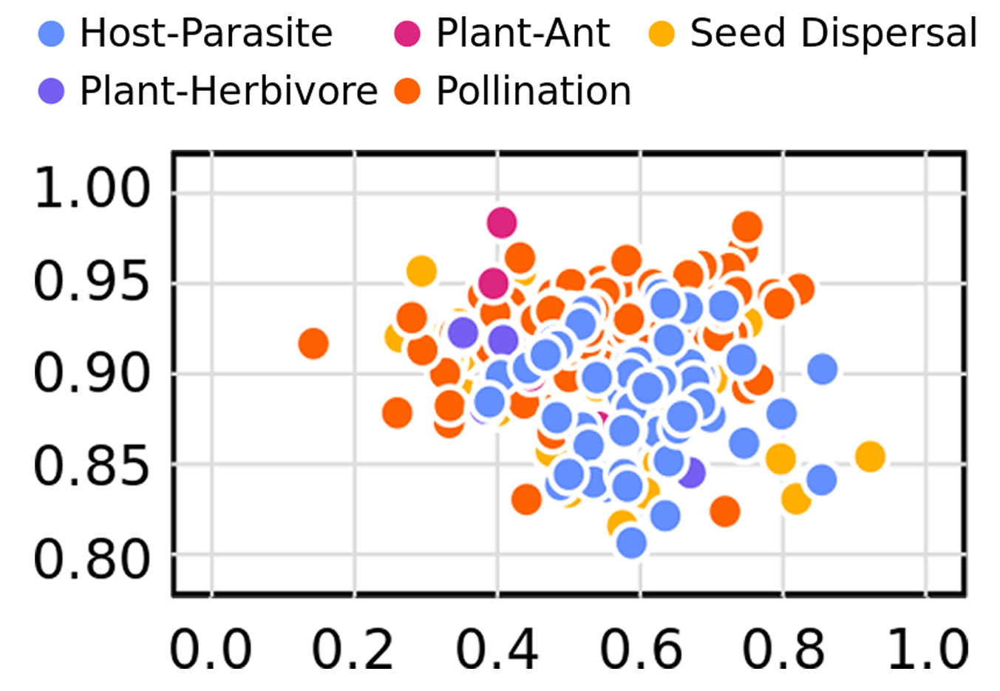

```{r setup, include=FALSE}
knitr::opts_chunk$set(echo = TRUE, eval = FALSE, collapse = TRUE, comment = ">")
options(htmltools.dir.version = FALSE)
htmltools::tagList(rmarkdown::html_dependency_font_awesome())
```

```{r xaringan-themer, include=FALSE, warning=FALSE}
library(xaringanthemer)
style_duo_accent(
  primary_color = "#4B384C",
  secondary_color = "#FF961C"
)
```

# The complexity of communities

.pull-left[
Quantifying the complexity and stability of communities remains a challenge.
]


<span 
  style="
  margin-left:-5%; 
  position: absolute; 
  top: 5%">
  
</span>

???


--

<span style="margin: 0;
  position: absolute;
  bottom: 30%;
  text-align: left;
  left: 7%;"> Network theory provides a <br>
  powerful approach <br>
  and allows us <br>
  to infer ecological properties <br>
  and processes
</span>
  
<span 
  style="
  margin-left:-5%; 
  position: absolute; 
  top: 5%">
  
</span>

???
Complexity and stability are issues that have been studied but has remained a challenge to quantify. The debate is still prevalent in ecology

---

# A traditional definition of complexity

Assume that a system is complex because it has many parts *i.e.* measuring structural complexity

--

.pull-left[
**Nestedness**

Do species assemblages form subsets of larger assemblages?
]

.pull-right[
**Connectance**

What proportion of potential interaction are realised?
]

<span 
  style="
  margin-left:0%; 
  position: absolute; 
  top: 35%">
  
</span>

???
Nestedness would look at specialists vs generalists
---

# Taking a physical approach to complexity

Instead we can measure the 'physical complexity' *i.e.* the amount of information required to encode the system

--

<span 
  style="
  margin-left:0%; 
  position: absolute; 
  top: 42%">
  
</span>

<span 
  style="
  margin-left:50%; 
  position: absolute; 
  top: 42%">
  
</span>
---

# Estimating complexity using SVD

$$\mathbf{A} = \mathbf{U}\cdot\mathbf{\Sigma}\cdot\mathbf{V}^T$$

<span 
  style="
  margin-left:-4%; 
  position: absolute; 
  top: 35%">
  
</span>

---

# SVD Entropy as internal complexity

Using the $\sigma$ values from $\mathbf{\Sigma}$ and following Pielou's evenness  (Pielou 1975) we can ensure that $\sigma$ values are less than one:

$$
s_i = \sigma_i/\text{sum}(\sigma)
$$

--

and estimate entropy following Shannon (1948) as:


$$
J = -\frac{1}{\ln(k)}\sum_{i=1}^k s_i\cdot\ln(s_i)
$$

--

High values of SVD entropy reflects that all vectors are equally important, *i.e.* we cannot efficiently compress the network, indicating high complexity 

???

where k is the max rank

---

# SVD Entropy as internal complexity

<span 
  style="
  margin-left:0%; 
  position: absolute; 
  top: 30%">
  
</span>

---
# SVD Entropy of Networks

Ecological networks are *extremely* complex

<span 
  style="
  margin-left:0%; 
  position: absolute; 
  top: 20%">
  
</span>

---
# Network Structure Captures Network Complexity 


<span 
  style="
  margin-left:15%; 
  position: absolute; 
  top: 25%">
  
</span>

--

 .footnote[But then things begin to tell a different story...]
---
# Complex does not mean robust

--

<span 
  style="
  margin-left:10%; 
  position: absolute; 
  top: 30%">
  
</span>

???
First do the axes and then have the point appear
How do we define resilience in ecological terms -> focus on how we defined resilience


---

# What next?

+ Complexity is a slippery term to define

+ Different measures of complexity capture different ecological processes

  * *e.g.* simulating robustness to extinctions
  
+ SVD Entropy may provide a starting point to unifying the definition of complexity

.footnote[
For a more complete breakdown the preprint can be found at [doi.org/fmpt](https://doi.org/fmpt)
]

???
Visually draw it back so bring the images - we can use different measures of complexity and they can tell a different story, building lego blocks
