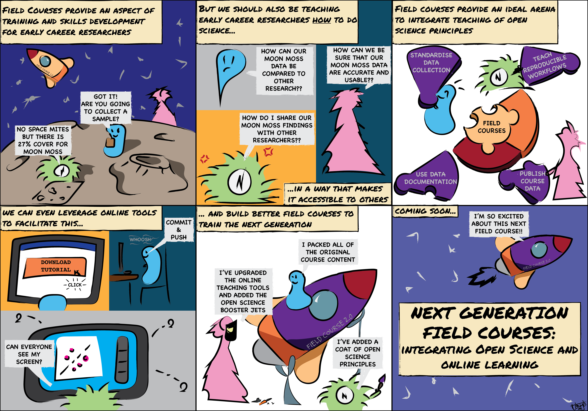

```{r setup, include=FALSE}
knitr::opts_chunk$set(echo = TRUE, eval = FALSE, collapse = TRUE, comment = ">")
options(htmltools.dir.version = FALSE)
htmltools::tagList(rmarkdown::html_dependency_font_awesome())
```

# The Backstory

.center[species interaction networks 🕸 + fancy maths 🧮 | FAIR & Open Science ⚖️ | part-time doodler 🎨 | warm beverage fan ☕]

--
.center[
<br>
Participant of the 5th [Plant Functional Traits Course](https://plantfunctionaltraitscourses.w.uib.no/)

Placed a lot of focus on doing reproducible science

<br>
Inspired [this](https://doi.org/10.1002/ece3.7009) manuscript on how we can incorporate

teaching FAIR and Open Science in 
student training
]

--

<span style="margin: 0;
  position: absolute;
  top: 31%;
  left: 15%;">
  </span>
  
--

<span style="margin: 0;
  position: absolute;
  top: 31%;
  left: 27%;">
  </span>

---

# What is Open Science?

.center[*A global movement to promote integrity, repeatability, and transparency across all aspects of scientific research*]

--

.pull-left[
**Which includes:**

- Open access to publications

- Open access to data

- Open source code and data handling
]

--

<span style="margin-left:-47%; position: absolute; top: 63%"></span>

---

# OS and the Data Lifecycle

.center[Open Science can help extend the lifespan of a dataset e.g. by allowing it to be reused for data synthesis or re-analysis
]

--
.center[

]

--

.center[
But in order for this to happen your data need to be **usable**
]

---

# Make your Science FAIR

.center[***F**indable, **A**ccessible, **I**nteroperable and **R**eproducible*]

.pull-left[

* Sharing data is the first step but not the only one

* **FAIR** principles focus on data usability

* Data are only as good as their documentation

]

--

.pull-right[

]

---

# So What?

+ Open Science will be the 'new normal' and is becoming an expectation for publication and funding

+ Open data leads to increased citations

--

+ It fosters collaboration and opens doors for what we can achieve with our research

+ It makes your (personal) workflow easier (especially for future you) **and** makes for easier collaborative work/writing
  + The little bit of extra time is worth it - trust me

---

# A Quick Case Study<sub style="font-size: medium;">(on what not to do)</sub>


.left-column[

* My honours file naming 'system'

* The 'amazing' documentation

* To quote the lobster from the *Little Mermaid* "it's a mess"

]

.right-column[

]

---

# Where to Start Though?


.left-column[

]

--

.footnote[[*] Respecting data sharing restrictions and embargoes]

.right-column[
- Think about how you enter your data
  * Follow data and metadata standards (e.g. [DarwinCore](https://www.tdwg.org/))
  * Document **everything** 


- Document data processing and analysis
  * Use code-based workflows
  * Annotate said code
  
  
- Archive data in an accessible way
  * Make as open and findable as possible<sup>*</sup>
  * See [here](https://journals.plos.org/ploscompbiol/article?id=10.1371/journal.pcbi.1005097) for some more tips
  
  
- Do some [futher reading](https://www.fosteropenscience.eu/courses)
]

---
class: inverse, middle, center

background-image: url(img/document.png)
background-position: bottom
background-size: 45%

# 1. Documenting, Documenting and Documenting

---
background-image: url(img/reproducible.png)
background-position: bottom right
background-size: 40%

# If it isn't Documented it Doesn't Exist

**Document all changes to raw data**
+ Ideally after inputting your data into a file<sup>*</sup> that file should remain unchanged. 
  + Data cleaning should be scripted
+ Using a script based workflow means you keep track of what and how things changed

.footnote[[*] Ideally using a non propriety format such as .csv or .txt]

.pull-right[]
--

.pull-left[
**Document the *entire* workflow**
+ Having metadata for variables - that's good
  + Mandatory I'd argue
+ Documenting how scripts 'work' - even better
]

---

background-image: url(img/Documentation.png)
background-size: 80%

---
class: inverse, middle, center

background-image: url(img/annotate.png)
background-position: bottom
background-size: 68%

# 2. Annotating code

---
background-image: url(img/accessible.png)
background-position: bottom left
background-size: 40%

# Annotations save lives <sub style="font-size: medium;">(and time)</sub>

.center[
Annotating your code by adding comments makes it easier for you (and others) to understand what or why you decided to do what you did
]

--

.pull-left[
- Annotations double up as pseudocode
  
  
- Detail specific changes or reasoning
  * Especially when cleaning or transforming data
  ]

--

.pull-right[
]


---
class: inverse, middle, center

background-image: url(img/octobiwan.png)
background-position: bottom
background-size: 35%

# 3. Data Archiving <sub style="font-size: medium;">(with bonus version control)</sub> 

---

# Get with GitHub

.center[
Think of GitHub as a google drive of sorts that you would keep your projects in - the only difference is that it has some bonus features.
]

* It has **Version Control:** This means that every time you re-upload a file the older versions are saved (and can be recouped if needed).
  + You can do this [straight from RStudio](https://happygitwithr.com/rstudio-git-github.html)
  + Everyone has the most up to date version on their device - *no more email chain!*
  

--

* It makes for easy **archiving** and **sharing**. Projects are hosted in repositories in the public domain.
  + Drop the link and everyone has read access
  + It's designed with documentation and hosting in mind
  
  
--

* It's **designed for programming:** Aside form simple storage of files you can design [workflows](https://docs.github.com/en/free-pro-team@latest/actions/learn-github-actions) that run jobs depending on what happens in the repository.

---

background-image: url(img/GitHub.png)
background-size: 100%

---

# GitHub: Fast facts

1. GitHub is the 'norm' in the world of Open Source  - so if you want to go open go with GitHub

1. [Happy Git and GitHub for the useR](https://happygitwithr.com) is a great starting point if you're interested
  + especially for installing Git on your device (it can be a bit confusing)

1. You can also have private repositories
  * So you can keep your work 'hidden' but still cash in on version control and easier collaborating
  
1. As university students you qualify for a [free pro account](https://education.github.com/pack) - *go for it it*

---

# Other Ways to Open your Science

+ Data archiving

+ Pre-registered reports

+ Preprints

+ Social media

+ ORCiD

<script src="https://ajax.googleapis.com/ajax/libs/jquery/2.1.3/jquery.min.js"></script>
    <script src="sketch.js"></script>
    <script src="dazzleSketch.js"></script>
---

Thank You

---

class: center, middle

Presentation created using **{xaringan}** (the **robot** theme)

Slides available at [https://tanyas08.github.io/Talks/2020_Dec_TUKS/](https://tanyas08.github.io/Talks/2020_Dec_TUKS/index.html)


