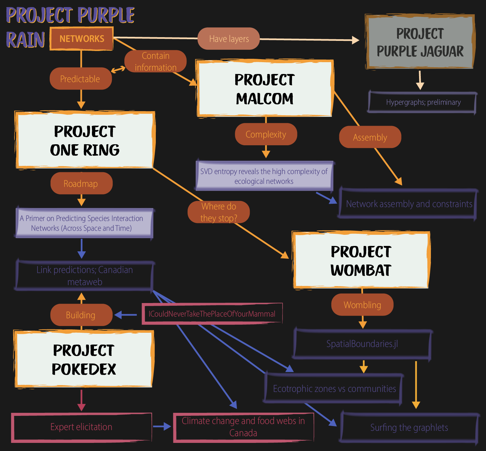
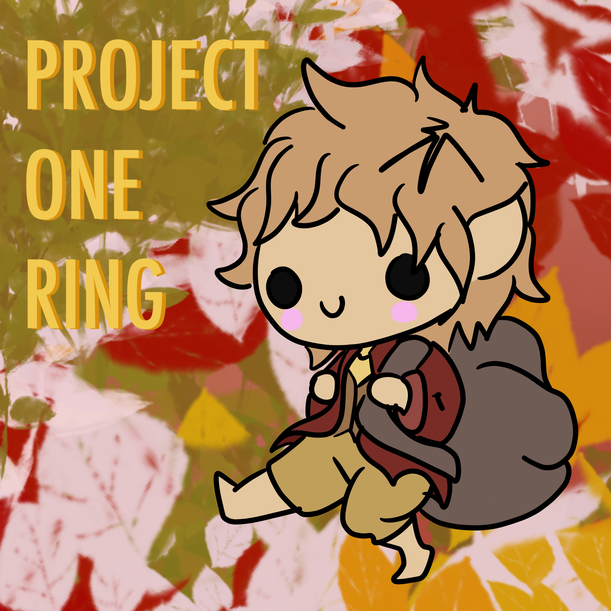
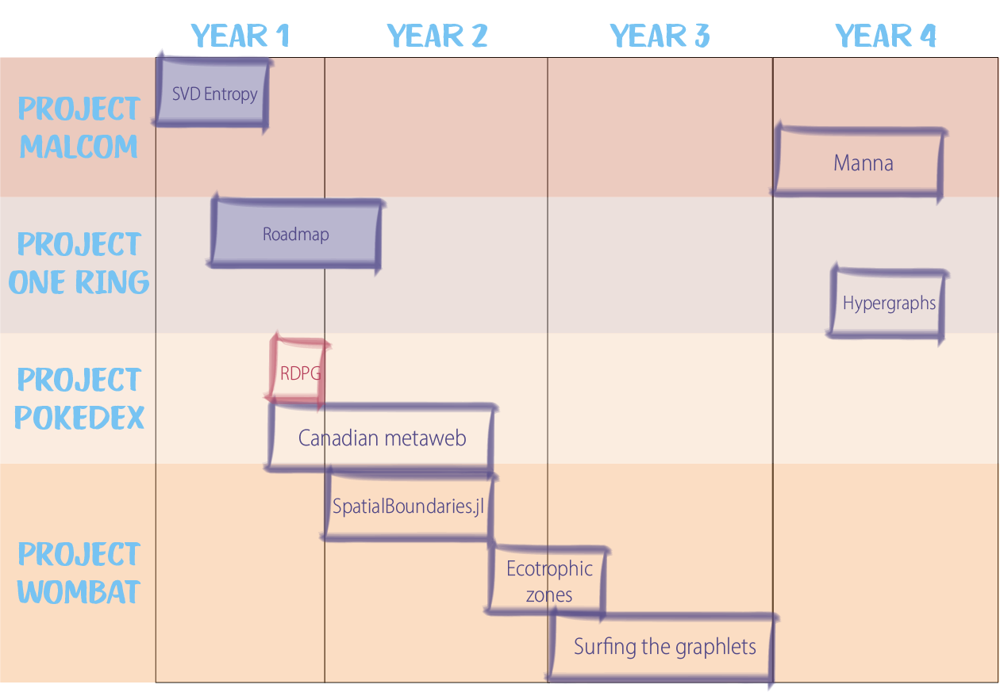

```{r setup, include=FALSE}
knitr::opts_chunk$set(echo = TRUE, eval = FALSE, collapse = TRUE, comment = ">")
options(htmltools.dir.version = FALSE)
htmltools::tagList(rmarkdown::html_dependency_font_awesome())
```

```{r xaringan-themer, include=FALSE, warning=FALSE}
library(xaringanthemer)
style_duo_accent(
  primary_color = "#4B384C",
  secondary_color = "#FF961C"
)
```

# Overview

<span 
  style="
  margin-left: 15%; 
  position: centre; 
  top: 15%">
  
</span>

---

# Project Purple Rain

## The Overview

*i.e what is the common thread?*

+ We know that networks contain information and we know that they are predictable
+ We also know that they are important for ecosystem functioning but they aren't considered a 'priority'

*Tackling this*

+ We cannot feasibly, empirically measure all network so we need a toolset to predict them -> `Project One Ring`
+ Let's see how well this works while also providing a 'management tool' -> `Project Pokedex`
+ Okay cool but what about the networks in *my* landscape -> `Project Wombat`
+ But also how are networks percieved? What is complexity anyway and what constrains it -> `Project Malcom` (this link is iffy at best...)

---

# Project Malcom

## Background

+ What can we learn form the information that networks contain?
+ Their complexity?
+ What about how assembly constrains complexity?

## SVD entropy reveals the high complexity of ecological networks

*Featuring GVDR*

+ Turns out ecologists have had it all wrong when it comes to network complexity...
+ Using SVD entropy as a measure of network complexity
+ Turns out they are very complex - *i.e.* Rule #1 has been displaced
+ Also some other cools things regarding connectence and complexity
+ **"Done"**

---

# Project Malcom

## The Manna program

+ Some stuff/thoughts from the Albuquerque airport... Its also in *C*
+ Another potential aspect to look into is the Island Biogeography Assembly models form Tad Dallas and Pedro Jordano
+ Looking at change in entropy as a function as well as simulating the correct values for connectence as opposed to the 'full spectrum' - Building on Andrew's work.
+ **Deliverable:** ??A network assembly model??

---

# Project One Ring

## Background

+ We know networks as well as their properties are predictable.
+ But do we have the toolset?
+ What does the future look like?

## A Primer on Predicting Species Interaction Networks (Across Space and Time)

*Featuring The Fellowship* 

+ How do we combine space and time into out predictions: a horizon scan.

+ **Pending reviewer feedback**

<span 
  style="
  margin-left:70%; 
  position: absolute; 
  top: 5%">
  
</span>

---

# Project One Ring

## Integration with Project Pokedex

+ *Featuring some members of The Fellowship and the The Rohirrim*


+ A mini case study/additional proof of concept??
+ Taking what we discussed in *A Primer on Predicting Species Interaction Networks (Across Space and Time)* and using that within `Project Pokedex` 
+ **Deliverable:** A Canadian metaweb (super simple)

<span 
  style="
  margin-left:70%; 
  position: absolute; 
  top: 5%">
  
</span>


---

# Project Wombat

## Background

+ How do networks vary across space? But also more simply where do they stop? How does this relate to the landscape?
+ A more practical output/take - WRT being able to map out 'discrete' ecotrophic zones
+ That being said there is also a theoretical component - especially if we build on the idea of how graphlets over space

## SpatialBoundaries.jl

+ Developing the needed toolset to actually do the wombling...
+ Focus would be on triangulation and lattice wombling
+ Maybe categorical?


+ **Deliverable:** *JOSS*-type ms

<span 
  style="
  margin-left:70%; 
  position: absolute; 
  top: 5%">
  
</span>

---

# Project Wombat

## The end of the ecological network

+ Where does one network end and the next start?
+ How does this link to landscape boundaries/changes
+ Do we see the same when overlaying with e.g. community composition
+ One idea that we *need* to look at is the idea of although we might have species turnover in the landscape but maybe we retain the network structure


+ **Deliverable:** Spp vs. networks vs. community boundaries across the same landscape. A biogeography perspective


<span 
  style="
  margin-left:70%; 
  position: absolute; 
  top: 5%">
  
</span>

---

# Project Wombat

## Surfing the graphlets

*Featuring M-J*

+ Idea is to use the metaweb from `Project Pokedex`
  + But also need to do some simulating...
+ How do *within* network dynamics change in space (and time)? *i.e.* the idea of a moving window
  + Different trophic levels/species perceive the landscape differently
  + Seasonality - migration, diet shifts
+ Moving beyond the 3 node motif/graphlets - (The backbone ms)
+ This would have a validation component as well


+ **Deliverable:** A methods, perspectives type paper on the validity/use case of this approach.

<span 
  style="
  margin-left:70%; 
  position: absolute; 
  top: 5%">
  
</span>

---

# Project Pokedex

## Link predictions; Canadian metaweb

+ The CIEE working group

+ Ties in with pt. 2 of `Project One Ring` - arguably is the 'leading edge' though...

+ <span style="color: #c45371; font-weight:bold">ICouldNeverTakeThePlaceOfYourMammal</span> 
  + *i.e.* The Blueprint pt.1 a quick 'n dirty 'does it work'
  + Sensu RDPG (GVDR & Stouffer's work)
  + Predicting networks from species phylogenies
  
+ Essentially can we say: European Metaweb + AI = Canadian Metaweb

+ **Deliverable:** A Canadian metaweb (super simple)

<span 
  style="
  margin-left:70%; 
  position: absolute; 
  top: 5%">
  
</span>

---

# Project Pokedex

## <span style="color: #c45371; font-weight:bold">The B-sides</span>

+ Ultimately a lot of spin-off projects will also come out of the CIEE working group

  + <span style="color: #c45371">1º Would be Dom's expert elicitation work</span>
  + <span style="color: #c45371">Climate change and food webs in Canada</span>
  + <span style="color: #c45371">AI vs Experts</span>
  
  
+ <span style="color: #c45371; font-weight:bold">ICouldNeverTakeThePlaceOfYourMammal</span> 
+ Other future plans?

<span 
  style="
  margin-left:70%; 
  position: absolute; 
  top: 5%">
  
</span>

---

# Project Purple Jaguar

**Prospective**

## Setting missiles to hypergraphs

+ Networks have layers - much like ogres
+ Can we aggregate these layers?
+ Would probably be something very short?
+ Maybe integrate with/as an appendix to `Project One Ring`?

*Although given out meeting with M-J I think Wombling has a lot more room to grow (Surfing the graphlets) and is also 'achievable'/feesible*

---

# The Time

<span 
  style="
  margin-left: 15%; 
  position: centre; 
  top: 15%">
  
</span>
