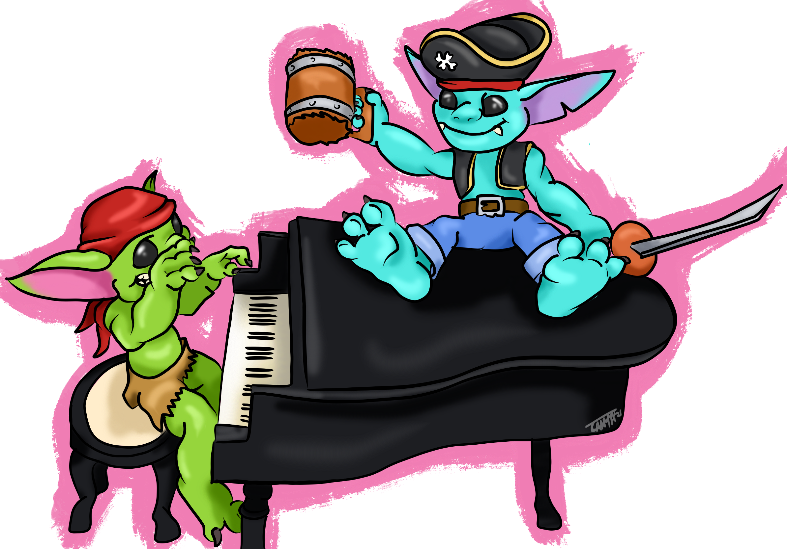

```{r setup, include=FALSE}
knitr::opts_chunk$set(echo = TRUE, eval = FALSE, collapse = TRUE, comment = ">")
options(htmltools.dir.version = FALSE)
htmltools::tagList(rmarkdown::html_dependency_font_awesome())
```

```{r xaringan-themer, include=FALSE, warning=FALSE}
library(xaringanthemer)
style_duo_accent(
  primary_color = "#4B384C",
  secondary_color = "#FF961C"
)
```

# Project Malcom

### *Episode I: The menace of complexity*

Featuring the stylings of GVDR

Redefining how we define complexity and maybe some additional exploring

.pull-left[
**Done**

+ SVD Entropy as a measure of network complexity
+ Networks could be more complex

**TODO**

+ Complexity and network assembly
+ What constrains complexity - vaguely
+ building on (and with?) GVDR's contributions to the OG ms

]


---

# Project One Ring

### *Episode II: The attack of the plans*

Featuring *The Fellowship*

A horizon scan of the toolsets and the future of predicting ecological networks - with a focus on ML

**Done**

+ Predicting networks: a roadmap

**TODO**
 
+ Could this link to `Project Pokedex`?
+ I feel there is room for expansion...
+ A part of me loves the idea of having something similar to Eva's `Analysing ecological networks of species interactions` ms but I don't know if this is necessarily feasible/exactly what that would look like...
 

<span 
  style="
  margin-left:70%; 
  position: absolute; 
  top: 5%">
  
</span>

---

# Project Wombat

### *Episode III: Only a Sith deals in absolute boundaries*

Featuring the scary unknown that is Marie-José Fortin

Rethinking what we use to draw lines across the landscape - something more indicative of the community than just composition

.pull-left[
+ Applying spatial wombling to ecological networks
+ thinking in terms of ecotrophic regions
+ Linking this up with `Project Pokedex`
+ With a `SpatialBoundaries.jl` as at least some sort of end product... 
]

<span 
  style="
  margin-left:0%; 
  position: absolute; 
  top: 43%">
  
</span>

---

# Project Purple Jaguar

### *Episode IV: A new hope for something cool*

There are two 'angles' that get me excited.

.pull-left[
**Hypergraphs + Networks**

+ Lower tier

**Linking up with Phil's work** **i.e.** `Project Padawan`

+ Would obviously need to talk to Phil
+ I'm thinking the ecological compliment to his evolutionary focus?
]

<span 
  style="
  margin-left:0%; 
  position: absolute; 
  top: 40%">
  
</span>

---

# The 'Side Quests'

i.e. things that are either Appendix-able or could contribute to other chapters

## Project Pokedex

### *CIEE: A metaweb story*

+ Building a metaweb for Canadian vertebrates

+ This could arguably/probably feed into both Project One Ring and Project Wombat...

## Project Padawan

### *Typed Theory: Who needs maths?*

+ Things that involve a lot of words that make ecologists curl up in a ball and cry

## Project(s) Plunderling

+ Side Quest::Unrelated

<span 
  style="
  margin-left:60%; 
  position: absolute; 
  top: 74%">
  
</span>

---

# Project Pokedex

### Marrying Projects Wombat and Pokedex

*i.e.* 'leveraging' the CIEE/Canadian Metaweb working group as an opportunity to grow the potential (expand the horizons/take it to new levels we could not previously concieve) of the original idea.

+ Does phase I (constructing metaweb) marry with points discussed in `Project One Ring`?
+ How can we feed work form `Project Pokedex` into `Project Wombat`?
