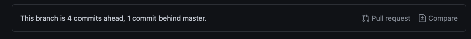
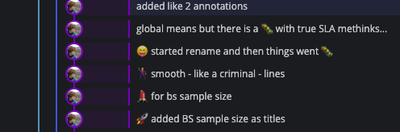

```{r setup, include=FALSE}
knitr::opts_chunk$set(echo = TRUE, eval = FALSE, collapse = TRUE, comment = ">")
options(htmltools.dir.version = FALSE)
htmltools::tagList(rmarkdown::html_dependency_font_awesome())
```

# TanyaS08/PFTC5_Gr3

.center[
The place where all code based things should happen
]

<span style="margin: 0;
  position: absolute;
  top: 30%;
  left: 1%;">
  </span>

---

# Get with GitHub

.center[
Think of GitHub your normal documents folder(s) - the only difference is that it has some bonus features.
]

* It has **Version Control:** This means that every time you re-upload a file the older versions are saved.
  + You can do the 'uploading' & 'downloading' [straight from RStudio](https://happygitwithr.com/rstudio-git-github.html)
  + Everyone has the most up to date version on their device - *no more email chain!*
  

* It makes for easy **archiving** and **sharing**. Projects are hosted in repositories in the public domain.
  + Drop the link and everyone has read access
  + It's designed with documentation and hosting in mind

* And for our use case today - we can do work in 'modular units' *i.e.* work in isolation but still in collaboration *(I'm judging myself for this phrase don't worry)*


---

# Housekeeping rules

.center[To make this house a home (and everyones lives simpler) there are some guidelines in place - also in the [README](https://github.com/TanyaS08/PFTC5_Gr3#readme)]

+ One sub task = one branch
+ PR's should be reviewed before merging branches with `master`
+ Keep commits informative - but emoji use is always encouraged
+ Name scripts after tasks


<span style="margin: 0;
  position: absolute;
  top: 60%;
  left: 10%;">
  </span>
  
<span style="margin: 0;
  position: absolute;
  top: 60%;
  left: 55%;">
  </span>

---

# Why have Rules?

.center[
Simply put having this seemingly convoluted system of working in different branches/sub units means things are isolated and that there are different checks and balances in place before we weave everything together

It also means that there is some transparency to the work we are doing and others in the team can 'check in' on progress and be quickly brought up to speed if needed

Things can easily be found!
]

--

**Housekeeping Rules**

+ One sub task = one branch + Reviews **= Modularity and check points**

+ Keep commits informative + discussions **= 'Historic records'**

+ Name scripts after tasks **= Locate-ability**


---

# Working on Branches

.center[ *To Fork or to Clone?:*
Although forking is great if you are developing your own thing this is a bit more of a collaborative project and keeping tabs across (and finding) different forks is time consuming. So we can clone the Repo and work on branches
]

.pull-left[

* Branches make a copy of the 'main' repo - called `master`

* Any changes you make will only be on your branch and not affect `master` or any other branches

* This means we can 'contain' work; check it and then have it rejoin `master`


]

---

# Branches: A Case study on modularity

.center[ 
We recently wrote an entire manuscript using a GitHub workflow - each section was its own branch which was only added to the 'main' manuscript after being reviewed by others
]

--

Each task was on its own branch

<span style="margin: 0;
  position: absolute;
  top: 40%;
  left: 50%;">
  </span>


--

.pull-left[ Once they were reviewed they start 'collapsing' back into `master`]

<span style="margin: 0;
  position: absolute;
  top: 60%;
  left: 10%;">
  </span>


---

# Branches can be Pull Requests (PRs)

.center[When we want to merge our branch back to `master` we can create a 
pull request that 1) makes sure there are no conflicts and 2) allows for **review**]

.pull-left[

* If each task is on a branch then can turn it into a PR

* PRs have other feature's like assigning people to it, code review and discussions

* This acts as a check point and means we can look at work done on one task without having to weed through other task changes

]

<span style="margin: 0;
  position: absolute;
  top: 45%;
  left: 50%;">
  </span>
  
<span style="margin: 0;
  position: absolute;
  top: 55%;
  left: 60%;">
  </span>
  
  
<span style="margin: 0;
  position: absolute;
  top: 80%;
  left: 50%;">
  </span>

---
# Informative commit messages

.center[I like to say the information is in the emojj... but maybe not always. *i.e. I just want to have fun with commit messages here...* ]

<span style="margin: 0;
  position: absolute;
  top: 40%;
  left: 10%;">
  </span>
  
<span style="margin: 0;
  position: absolute;
  top: 50%;
  left: 40%;">
  </span>
  
<span style="margin: 0;
  position: absolute;
  top: 70%;
  left: 10%;">
  </span>
  
<span style="margin: 0;
  position: absolute;
  top: 70%;
  left: 60%;">
  </span>

---
# Can also document things in the PR

<span style="margin: 0;
  position: absolute;
  top: 18%;
  left: 40%;">
  </span>

---
# Starting a new Sub-task

1. Create a branch named after the sub-task
    + If using the {usethis} workflow: `usethis::pr_init(branch = "BRANCH_NAME")`
    
2. Make a Pull Request
  + `usethis::pr_push()`
  
3. Mark as a draft (in web browser)
  + Not critical
  
4. Assign relevant people (in web browser)

5. Do stuff...

6. Request review when/as needed

---
# General things to remember

+ Pull (almost always), commit and push (often)

+ You are going to mess up and that's okay - feel free to bother me (or whoever you feel comfortable talking to)

  + This is a learning experience after all
  
+ If all else fails version history will probably save your life...

<span style="margin: 0;
  position: absolute;
  top: 55%;
  left: 10%;">
  </span>
  
<span style="margin: 0;
  position: absolute;
  top: 60%;
  left: 60%;">
  </span>
